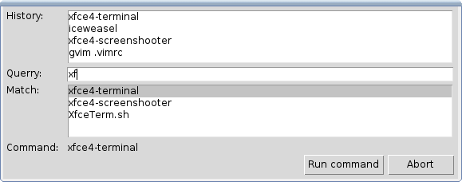

# DOCUMENTATION : fuzzy-run

## General Info

* fuzzy-run: quickly execute a command from your command history.
* Language: python
* Usage: fuzzy-run
* Creation Date: December 2013
* Web-Site: 
    - http://github.com/elmanuelito/fuzzy-run
* License: None. Thank you for sharing your improvements to me by email.

## DESCRIPTION

fuzzy-run is an application launcher to be used without the mouse (vim-bindings, but may be changed). In most usage, typing 4 characters and Enter should launch the right application. 
The program searches in a "fuzzy" way in a list of previously run commands, or alternatively one can circle through the history of commands.
Each command run is automatically added to the command list.

This program is a light alternative to ubuntu-dash/xfrun4/xfce4-appfinder since none of them could suit my need.

The search algorithm is composed of two parts. The first part is similar to the "Ctrl-P" search. It requires that the characters in the search string are present in the command string and in the proper order. They do not need to be successive characters though. Lower-case characters will match all case, whereas an upper-case letter requires and exact case match. The second part used the Levenshtein distance to select results that are the closest.  

The program has a pretty ugly GUI (based on Tkinter). It should run rather fast and smooth on multiple platforms and may easily be customized. 

I'm open to any kind of improvements!

## USAGE AND FEATURES
Key-bindings may be modified as the beginning of the script.
* Ctrl-k and Ctrt-j: circle through the history of previous commands
* Ctrl-n and Ctrt-p: circle through the results
* Enter: execute the command (the one displayed after "Command:")
* Tab: perfom completion based on the selected results
* Esc: abort the history loop / purge the results / clear the search string / exit the program

The number of lines of history and results may be modified at the beginning of the script.

The list of commands and the command history are two text files located in the directory of the script. Simply edit these files to modify the command list.

## REQUIREMENTS
You need to install the following:
    python
    python-tk
    python-levenshtein

It should be cross-platform, but has been tested on linux only.

## INSTALLATION
Make the script executable and put it in your path

